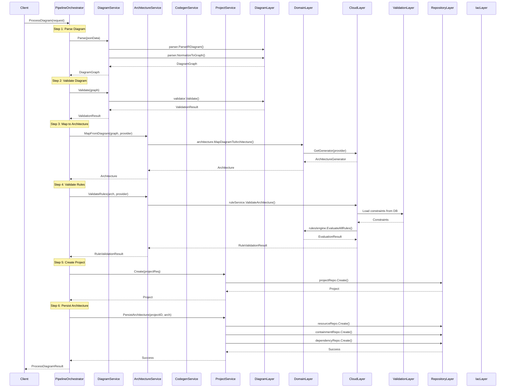

# Service Layer - Platform Orchestration

This package provides a comprehensive service layer that orchestrates all layers of the architecture visualization system. It serves as the **central orchestration hub** that coordinates between the diagram layer, domain layer, cloud layer, IaC layer, validation layer, constraints layer, and platform repository layer.

## Overview

The service layer acts as a **facade** and **orchestrator** that:
- **Decouples** business logic from infrastructure concerns
- **Coordinates** multiple layers through well-defined interfaces
- **Manages** the complete lifecycle from diagram JSON to persisted project and generated IaC code
- **Enables** dependency injection for testability and flexibility

## Architecture

```
┌─────────────────────────────────────────────────────────────────┐
│                    Service Layer (This Package)                  │
│                                                                 │
│  ┌──────────────┐  ┌──────────────┐  ┌──────────────┐          │
│  │   Diagram    │  │ Architecture │  │   Codegen    │          │
│  │   Service   │  │   Service    │  │   Service    │          │
│  └──────┬──────┘  └──────┬──────┘  └──────┬──────┘          │
│         │                 │                 │                  │
│  ┌──────▼─────────────────▼─────────────────▼──────┐          │
│  │         PipelineOrchestrator                     │          │
│  │    (Orchestrates complete workflows)             │          │
│  └─────────────────────────────────────────────────┘          │
│                                                                 │
│  ┌─────────────────────────────────────────────────┐          │
│  │         ProjectService                          │          │
│  │    (Manages persistence operations)             │          │
│  └─────────────────────────────────────────────────┘          │
└─────────────────────────────────────────────────────────────────┘
         │                    │                    │
         ▼                    ▼                    ▼
┌────────────────┐  ┌────────────────┐  ┌────────────────┐
│  Diagram Layer │  │  Domain Layer   │  │   Cloud Layer   │
│  (Parser/      │  │  (Architecture/ │  │  (AWS/Azure/   │
│   Validator)   │  │   Rules/Graph)  │  │   GCP Rules)   │
└────────────────┘  └────────────────┘  └────────────────┘
         │                    │                    │
         ▼                    ▼                    ▼
┌────────────────┐  ┌────────────────┐  ┌────────────────┐
│   IaC Layer    │  │ Validation     │  │  Platform       │
│  (Terraform/   │  │  Layer         │  │  Repository     │
│   Pulumi)      │  │  (Constraints) │  │  (Database)     │
└────────────────┘  └────────────────┘  └────────────────┘
```

## Complete Workflow: Diagram to Code

The following diagram shows how the service layer orchestrates the complete flow:



## Layer Orchestration Details

### 1. Diagram Layer Integration

**Service**: `DiagramService`  
**Integrates With**: `internal/diagram/parser`, `internal/diagram/validator`

**Responsibilities**:
- Parses JSON diagram data into normalized graph structure
- Validates diagram structure, schemas, and relationships
- Provides clean interface for diagram operations

**Flow**:
```
JSON Data → DiagramService.Parse() → parser.ParseIRDiagram() → parser.NormalizeToGraph() → DiagramGraph
DiagramGraph → DiagramService.Validate() → validator.Validate() → ValidationResult
```

### 2. Domain Layer Integration

**Service**: `ArchitectureService`  
**Integrates With**: `internal/domain/architecture`, `internal/domain/rules/engine`

**Responsibilities**:
- Maps diagram graphs to domain architecture aggregates
- Validates architecture against domain rules
- Performs topological sorting of resources

**Flow**:
```
DiagramGraph → ArchitectureService.MapFromDiagram() → architecture.MapDiagramToArchitecture() → Architecture
Architecture → ArchitectureService.ValidateRules() → ruleService.ValidateArchitecture() → RuleValidationResult
Architecture → ArchitectureService.GetSortedResources() → architecture.NewGraph().GetSortedResources() → []Resource
```

### 3. Cloud Layer Integration

**Service**: `ArchitectureService` (via RuleService adapter)  
**Integrates With**: `internal/cloud/aws/rules`, `internal/cloud/aws/architecture`

**Responsibilities**:
- Provides cloud provider-specific rule validation
- Maps IR types to cloud-specific resource types
- Applies cloud provider constraints

**Flow**:
```
Architecture → RuleService.ValidateArchitecture() → aws/rules.ValidateArchitecture() → EvaluationResult
DiagramGraph → architecture.MapDiagramToArchitecture() → cloud/aws/architecture.Generate() → Architecture
```

### 4. Validation & Constraints Layer Integration

**Service**: `ArchitectureService` (via RuleService)  
**Integrates With**: `internal/domain/rules`, `internal/platform/repository` (for constraints)

**Responsibilities**:
- Loads constraints from database
- Evaluates rules against architecture
- Provides validation results with detailed errors

**Flow**:
```
Architecture → RuleService.ValidateArchitecture() → 
  → constraintRepo.FindByResourceType() → Constraints
  → rules/engine.EvaluateAllRules() → EvaluationResult
```

### 5. IaC Layer Integration

**Service**: `CodegenService`  
**Integrates With**: `internal/iac/terraform`, `internal/iac/pulumi`, `internal/cloud/aws/mapper/terraform`

**Responsibilities**:
- Generates Infrastructure as Code from architecture
- Supports multiple IaC engines (Terraform, Pulumi)
- Uses cloud provider-specific mappers

**Flow**:
```
Architecture → CodegenService.Generate() → 
  → iac/terraform/generator.Generate() → 
  → cloud/aws/mapper/terraform.MapResource() → 
  → iac.Output (Generated Files)
```

### 6. Platform Repository Layer Integration

**Service**: `ProjectService`  
**Integrates With**: `internal/platform/repository/*`, `internal/platform/models`

**Responsibilities**:
- Manages project CRUD operations
- Persists architecture to database
- Handles transactions for atomicity

**Flow**:
```
CreateProjectRequest → ProjectService.Create() → projectRepo.Create() → Project
Architecture → ProjectService.PersistArchitecture() → 
  → resourceRepo.Create() → Resources
  → containmentRepo.Create() → Containments
  → dependencyRepo.Create() → Dependencies
```

## Service Implementations

### DiagramService

Wraps diagram parsing and validation:

```go
type DiagramServiceImpl struct {
    // Stateless - no dependencies needed
}

func (s *DiagramServiceImpl) Parse(ctx context.Context, jsonData []byte) (*graph.DiagramGraph, error) {
    irDiagram, err := parser.ParseIRDiagram(jsonData)
    diagramGraph, err := parser.NormalizeToGraph(irDiagram)
    return diagramGraph, nil
}

func (s *DiagramServiceImpl) Validate(ctx context.Context, graph *graph.DiagramGraph, opts *validator.ValidationOptions) (*validator.ValidationResult, error) {
    return validator.Validate(graph, opts), nil
}
```

### ArchitectureService

Orchestrates architecture mapping and validation:

```go
type ArchitectureServiceImpl struct {
    ruleService serverinterfaces.RuleService
}

func (s *ArchitectureServiceImpl) MapFromDiagram(ctx context.Context, graph *graph.DiagramGraph, provider resource.CloudProvider) (*architecture.Architecture, error) {
    arch, err := architecture.MapDiagramToArchitecture(graph, provider)
    // Uses cloud provider-specific generator from registry
    return arch, nil
}

func (s *ArchitectureServiceImpl) ValidateRules(ctx context.Context, arch *architecture.Architecture, provider resource.CloudProvider) (*RuleValidationResult, error) {
    engineArch := &engine.Architecture{Resources: arch.Resources}
    results, err := s.ruleService.ValidateArchitecture(ctx, engineArch)
    // Converts results to RuleValidationResult
    return validationResult, nil
}
```

### CodegenService

Manages IaC code generation:

```go
type CodegenServiceImpl struct {
    engines map[string]iac.Engine
}

func (s *CodegenServiceImpl) Generate(ctx context.Context, arch *architecture.Architecture, engine string) (*iac.Output, error) {
    iacEngine := s.engines[engine]
    graph := architecture.NewGraph(arch)
    sorted, err := graph.GetSortedResources()
    return iacEngine.Generate(ctx, arch, sorted)
}
```

### ProjectService

Handles persistence operations:

```go
type ProjectServiceImpl struct {
    projectRepo        serverinterfaces.ProjectRepository
    resourceRepo       serverinterfaces.ResourceRepository
    // ... other repositories
}

func (s *ProjectServiceImpl) PersistArchitecture(ctx context.Context, projectID uuid.UUID, arch *architecture.Architecture, diagramGraph interface{}) error {
    tx, txCtx := s.projectRepo.BeginTransaction(ctx)
    // Create resources
    // Create containments
    // Create dependencies
    return s.projectRepo.CommitTransaction(tx)
}
```

### PipelineOrchestrator

Orchestrates the complete workflow:

```go
type PipelineOrchestratorImpl struct {
    diagramService      serverinterfaces.DiagramService
    architectureService serverinterfaces.ArchitectureService
    codegenService      serverinterfaces.CodegenService
    projectService      serverinterfaces.ProjectService
}

func (o *PipelineOrchestratorImpl) ProcessDiagram(ctx context.Context, req *ProcessDiagramRequest) (*ProcessDiagramResult, error) {
    // Step 1: Parse diagram
    graph, err := o.diagramService.Parse(ctx, req.JSONData)
    
    // Step 2: Validate diagram
    validationResult, err := o.diagramService.Validate(ctx, graph, nil)
    
    // Step 3: Map to architecture
    arch, err := o.architectureService.MapFromDiagram(ctx, graph, provider)
    
    // Step 4: Validate rules
    ruleValidationResult, err := o.architectureService.ValidateRules(ctx, arch, provider)
    
    // Step 5: Create project
    project, err := o.projectService.Create(ctx, createProjectReq)
    
    // Step 6: Persist architecture
    err := o.projectService.PersistArchitecture(ctx, project.ID, arch, graph)
    
    return &ProcessDiagramResult{ProjectID: project.ID}, nil
}
```

## Dependency Injection Pattern

The service layer uses **constructor injection** for all dependencies:

```go
// Server initialization in server.go
func NewServer() (*Server, error) {
    // 1. Initialize concrete repositories
    projectRepo, _ := repository.NewProjectRepository()
    resourceRepo, _ := repository.NewResourceRepository()
    // ...
    
    // 2. Create adapters (bridge pattern)
    projectRepoAdapter := &services.ProjectRepositoryAdapter{Repo: projectRepo}
    resourceRepoAdapter := &services.ResourceRepositoryAdapter{Repo: resourceRepo}
    // ...
    
    // 3. Initialize services with injected dependencies
    diagramService := services.NewDiagramService() // Stateless
    ruleService := services.NewAWSRuleServiceAdapter() // Cloud-specific
    architectureService := services.NewArchitectureService(ruleService)
    codegenService := services.NewCodegenService()
    projectService := services.NewProjectService(
        projectRepoAdapter,
        resourceRepoAdapter,
        // ... other adapters
    )
    
    // 4. Create orchestrator with all services
    pipelineOrchestrator := orchestrator.NewPipelineOrchestrator(
        diagramService,
        architectureService,
        codegenService,
        projectService,
    )
    
    return &Server{
        DiagramService:      diagramService,
        ArchitectureService: architectureService,
        CodegenService:      codegenService,
        ProjectService:      projectService,
        PipelineOrchestrator: pipelineOrchestrator,
    }, nil
}
```

## Layer Interaction Matrix

| Service | Diagram Layer | Domain Layer | Cloud Layer | Validation Layer | IaC Layer | Repository Layer |
|---------|--------------|--------------|-------------|------------------|-----------|------------------|
| **DiagramService** | ✅ Parser<br>✅ Validator | - | - | - | - | - |
| **ArchitectureService** | - | ✅ Architecture<br>✅ Graph<br>✅ Rules Engine | ✅ Rule Service<br>✅ Architecture Generator | ✅ Constraints | - | - |
| **CodegenService** | - | ✅ Architecture<br>✅ Graph | ✅ Terraform Mapper | - | ✅ Terraform Engine<br>✅ Pulumi Engine | - |
| **ProjectService** | - | ✅ Architecture | - | - | - | ✅ All Repositories |
| **PipelineOrchestrator** | ✅ Via DiagramService | ✅ Via ArchitectureService | ✅ Via ArchitectureService | ✅ Via ArchitectureService | ✅ Via CodegenService | ✅ Via ProjectService |

## Data Flow Through Layers

```
┌─────────────────────────────────────────────────────────────────┐
│                         Input: JSON Diagram                      │
└──────────────────────────────┬──────────────────────────────────┘
                                │
                                ▼
┌─────────────────────────────────────────────────────────────────┐
│  Diagram Layer                                                  │
│  - Parse JSON → IRDiagram                                       │
│  - Normalize → DiagramGraph                                     │
│  - Validate structure/schemas                                    │
└──────────────────────────────┬──────────────────────────────────┘
                                │ DiagramGraph
                                ▼
┌─────────────────────────────────────────────────────────────────┐
│  Domain Layer (via ArchitectureService)                         │
│  - Map DiagramGraph → Architecture                              │
│  - Uses Cloud Provider Generator (from Cloud Layer)             │
│  - Build resource relationships                                 │
└──────────────────────────────┬──────────────────────────────────┘
                                │ Architecture
                                ▼
┌─────────────────────────────────────────────────────────────────┐
│  Validation Layer (via ArchitectureService)                      │
│  - Load constraints from Repository Layer                       │
│  - Evaluate rules via Cloud Layer Rule Service                  │
│  - Return validation results                                    │
└──────────────────────────────┬──────────────────────────────────┘
                                │ Validated Architecture
                                ▼
┌─────────────────────────────────────────────────────────────────┐
│  Repository Layer (via ProjectService)                          │
│  - Create Project                                              │
│  - Persist Resources                                            │
│  - Persist Containments                                         │
│  - Persist Dependencies                                         │
└──────────────────────────────┬──────────────────────────────────┘
                                │ Persisted Project
                                ▼
┌─────────────────────────────────────────────────────────────────┐
│  IaC Layer (via CodegenService)                                 │
│  - Topologically sort resources                                 │
│  - Use Cloud Provider Mapper                                    │
│  - Generate Terraform/Pulumi code                               │
└──────────────────────────────┬──────────────────────────────────┘
                                │
                                ▼
┌─────────────────────────────────────────────────────────────────┐
│                    Output: Generated IaC Files                   │
└─────────────────────────────────────────────────────────────────┘
```

## Usage Examples

### Complete Workflow

```go
import "github.com/mo7amedgom3a/arch-visualizer/backend/internal/platform/server"

// Initialize server (wires all dependencies)
srv, err := server.NewServer()
if err != nil {
    log.Fatalf("Failed to create server: %v", err)
}

// Process diagram through complete pipeline
result, err := srv.PipelineOrchestrator.ProcessDiagram(ctx, &serverinterfaces.ProcessDiagramRequest{
    JSONData:      jsonData,
    UserID:        userID,
    ProjectName:   "My Architecture",
    IACToolID:     1, // Terraform
    CloudProvider: "aws",
    Region:        "us-east-1",
})

if err != nil {
    log.Fatalf("Failed to process diagram: %v", err)
}

fmt.Printf("Project created: %s\n", result.ProjectID)
```

### Individual Service Usage

```go
// Use DiagramService directly
diagramService := srv.DiagramService
graph, err := diagramService.Parse(ctx, jsonData)
validationResult, err := diagramService.Validate(ctx, graph, nil)

// Use ArchitectureService directly
archService := srv.ArchitectureService
arch, err := archService.MapFromDiagram(ctx, graph, resource.AWS)
validationResult, err := archService.ValidateRules(ctx, arch, resource.AWS)

// Use CodegenService directly
codegenService := srv.CodegenService
output, err := codegenService.Generate(ctx, arch, "terraform")

// Use ProjectService directly
projectService := srv.ProjectService
project, err := projectService.Create(ctx, &serverinterfaces.CreateProjectRequest{
    UserID:        userID,
    Name:          "My Project",
    IACTargetID:   1,
    CloudProvider: "aws",
    Region:        "us-east-1",
})
```

## Testing

The service layer is designed for easy testing through dependency injection:

```go
// Create mocks
mockDiagramService := &MockDiagramService{}
mockArchitectureService := &MockArchitectureService{}
mockCodegenService := &MockCodegenService{}
mockProjectService := &MockProjectService{}

// Create orchestrator with mocks
orchestrator := orchestrator.NewPipelineOrchestrator(
    mockDiagramService,
    mockArchitectureService,
    mockCodegenService,
    mockProjectService,
)

// Test the orchestrator
result, err := orchestrator.ProcessDiagram(ctx, req)
```

See test files in `services/*_test.go` and `orchestrator/pipeline_test.go` for examples.

## Design Principles

1. **Separation of Concerns**: Each service has a single, well-defined responsibility
2. **Dependency Injection**: All dependencies injected via constructors
3. **Interface-Based Design**: Services depend on interfaces, not concrete types
4. **Adapter Pattern**: Repository adapters bridge concrete repositories to interfaces
5. **Orchestration**: PipelineOrchestrator composes services for high-level workflows
6. **Cloud-Agnostic Core**: Domain layer remains cloud-agnostic; cloud specifics in adapters
7. **Testability**: Easy to mock and test through interfaces

## Future Enhancements

- [ ] Add support for loading architecture from existing projects
- [ ] Add support for updating existing projects
- [ ] Add support for multiple cloud providers in rule validation
- [ ] Add support for Pulumi code generation
- [ ] Add caching layer for improved performance
- [ ] Add event-driven architecture for async processing
- [ ] Add support for batch operations

## Related Documentation

- [Domain Architecture Layer](../../domain/architecture/README.md) - Domain architecture layer documentation
- [Diagram Layer](../../diagram/README.md) - Diagram parsing and validation
- [Cloud Layer](../../cloud/aws/architecture/README.md) - Cloud provider implementations
- [IaC Layer](../../iac/README.md) - Infrastructure as Code generation
- [Platform Repository](../../platform/repository/README.md) - Repository layer documentation
