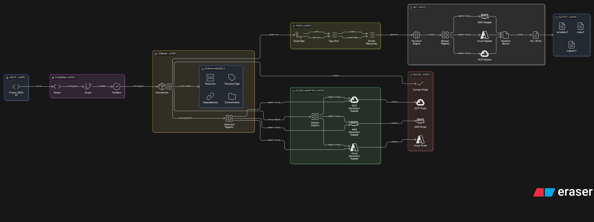

# Frontend ↔ Backend Workflow & Code Generation Process

This document explains how the frontend and backend collaborate to transform a visual cloud architecture into Infrastructure as Code (IaC) using a modular monolith backend.

---

## 🧭 High-Level Workflow Overview



```
Frontend (Canvas)
        ↓
API Layer
        ↓
Diagram Parser
        ↓
Diagram Graph
        ↓
Cloud Provider Architecture Generator
        ↓
Domain Architecture (with provider-specific mappings)
        ↓
Rules Engine (Validation)
        ↓
Topological Sort (Dependency Ordering)
        ↓
Cloud Provider Inventory (Terraform Mappers)
        ↓
IaC Engine (Terraform / Pulumi)
        ↓
Generated Code (Files / ZIP / Repo)
```

---

## 1️⃣ Frontend Responsibilities

The frontend is responsible for:

- **Visual architecture design** (drag & drop)
- **Enforcing basic UX constraints** (guided by backend rules)
- **Sending architecture state as JSON**
- **Displaying validation errors**
- **Downloading generated IaC output**

### What the Frontend Does NOT Do

- 🚫 Generate code
- 🚫 Enforce final validation
- 🚫 Perform complex transformations

---

## 2️⃣ Frontend → Backend JSON Contract

### 🔹 Diagram JSON (Request)

This JSON represents the canvas state sent to the backend.

```json
{
  "nodes": {
    "node-1": {
      "uuid": "node-1",
      "metadata": {
        "iac": {
          "resourceType": "aws_vpc",
          "resourceName": "main-vpc",
          "cloudProvider": "aws",
          "region": "us-east-1"
        }
      },
    "cloudConfigs": {
        "cidr_block": {
          "value": "10.0.0.0/16",
          "valueType": "string"
        }
      }
    }
  },
  "connectors": {
    "conn-1": {
      "from": "node-1",
      "to": "node-2",
      "type": "containment"
    }
  }, 
  "canvas": {
        "positions": {
            "node-1": {
                "x": 100,
                "y": 150
            },
            "node-2": {
                "x": 300,
                "y": 150
            }
        }
    }
}
```

### Connector Types

| Type | Meaning | Example |
|------|---------|---------|
| `containment` | Parent → child relationship | VPC → Subnet |
| `dependency` | Explicit dependency | IGW → VPC |
| `reference` | Attribute reference | Route → IGW |

---

## 3️⃣ API Layer (`internal/api`)

### Responsibilities

- Authentication & authorization
- Request validation
- DTO ↔ domain mapping
- Response formatting

### Example Endpoints

```
POST /api/architectures/validate
POST /api/architectures/generate
POST /api/projects/{id}/generate-code
```

### Design Principle

🚫 **No business logic here** — Only HTTP concerns.  
✅ **Delegates to internal services** for actual processing.

---

## 4️⃣ Diagram Module (`internal/diagram`)

Located in: [internal/diagram/](internal/diagram/)

### What Happens Here

1. **Parse** canvas JSON from frontend into `IRDiagram`
2. **Normalize** IR diagram into `DiagramGraph` (normalized graph structure)
3. **Validate** structural correctness (cycles, references, etc.)
4. **Output**: `DiagramGraph` ready for architecture generation

### Validations Performed

✅ No cyclic containment relationships  
✅ Valid connector types  
✅ Parent/child relationships exist  
✅ Required links are present  
✅ Resource references are valid  

### Output

A normalized diagram graph:

```go
DiagramGraph {
  Nodes: map[string]*Node
  Edges: []*Edge
}
```

**Note**: The diagram module does NOT create domain architectures. That's handled by cloud provider-specific architecture generators.

---

## 5️⃣ Domain Layer (`internal/domain`)

Located in: [internal/domain/](internal/domain/)

### Purpose

This is the **heart of the system** — the core business model.

### What It Contains

- **Resource definitions** — Abstract resource concepts
- **Resource types** — Categorical information
- **Relationships** — Parent/child, dependencies
- **Dependencies** — Resource interconnections
- **Architecture aggregates** — Top-level entities
- **Architecture Generator Interface** — Pluggable provider generators
- **Resource Type Mapper Interface** — Provider-specific type mappings

### Architecture Generation

The domain layer defines interfaces for cloud provider-specific architecture generation:

- **`ArchitectureGenerator`**: Interface for converting diagram graphs to domain architectures
- **`ResourceTypeMapper`**: Interface for mapping IR types and resource names to ResourceTypes
- **Registry System**: Manages provider-specific implementations

Each cloud provider implements these interfaces:
- AWS: `internal/cloud/aws/architecture/`
- Azure: `internal/cloud/azure/architecture/` (future)
- GCP: `internal/cloud/gcp/architecture/` (future)

### Design Principle

🚫 **No cloud-specific logic** (no AWS, GCP, Azure code)  
🚫 **No Terraform / Pulumi logic**  
✅ **Pure business logic** — Represents the user's intent  
✅ **Provider interfaces** — Defines contracts for provider implementations

### The Key Question This Layer Answers

> "What does this architecture mean?" (independently of cloud or tooling)

### Architecture Generation Flow

```
DiagramGraph
    ↓
MapDiagramToArchitecture(provider)
    ↓
Get Provider-Specific Generator (from registry)
    ↓
Generator.Generate() → Architecture
    ↓
Uses Provider-Specific ResourceTypeMapper
    ↓
Domain Architecture (with provider-specific resource types)
```

---

## 6️⃣ Rules Engine (`internal/rules`)

Located in: [internal/rules/](internal/rules/)

### Why This Layer Exists

Cloud architecture rules are **data-driven**, not hardcoded in code.  
Rules are stored in the **database** (`resource_constraints` table), enabling:

- Dynamic rule updates without code changes
- Different rules per cloud provider
- Extensibility without redeployment

### Example Constraints

| Resource | Constraint Type | Constraint Value |
|----------|-----------------|------------------|
| Subnet | `requires_parent` | VPC |
| IGW | `max_children` | 1 |
| EC2 | `allowed_parent` | Subnet |
| VPC | `requires_region` | true |
| RDS | `allowed_parent` | PrivateSubnet |

### Validation Process

For **each resource** in the architecture:

1. Load constraints from database
2. Evaluate constraints against architecture context
3. Collect errors (if any)
4. Return validation result

### Example Error Response

```json
{
  "valid": false,
  "errors": [
    {
      "resourceId": "subnet-1",
      "resourceName": "private-subnet",
      "message": "Subnet must be inside a VPC",
      "constraintType": "requires_parent"
    },
    {
      "resourceId": "ec2-1",
      "resourceName": "web-server",
      "message": "EC2 instance has 0 parents but requires 1 (Subnet)",
      "constraintType": "requires_parent"
    }
  ]
}
```

---

## 7️⃣ Cloud Layer (`internal/cloud`)

Located in: [internal/cloud/](internal/cloud/)

### Purpose

Handle **provider-specific differences** and implementations.

### Structure

Each cloud provider has its own isolated module:

```
internal/cloud/
├── aws/
│   ├── architecture/          # Architecture generation
│   │   ├── generator.go        # AWSArchitectureGenerator
│   │   ├── resource_type_mapper.go  # AWSResourceTypeMapper
│   │   └── registry.go        # Auto-registration
│   ├── inventory/             # Resource inventory system
│   │   ├── inventory.go       # Core inventory structures
│   │   ├── resources.go       # Resource classifications
│   │   └── registry.go        # Function registries
│   ├── models/
│   ├── services/
│   ├── repositories/
│   ├── mapper/
│   └── adapters/
├── gcp/
│   ├── architecture/
│   ├── inventory/
│   └── ...
└── azure/
    ├── architecture/
    ├── inventory/
    └── ...
```

### Responsibilities

- **Architecture Generation**: Provider-specific generators convert diagram graphs to domain architectures
- **Resource Type Mapping**: Provider-specific mappers handle IR type → ResourceType conversion
- **Inventory System**: Classifies resources and provides function registries (Terraform mappers, pricing calculators)
- **Domain → Provider Mapping**: Maps domain resources to provider-specific resources
- **Provider-Specific Defaults**: Applies naming conventions, regions, limits
- **Handles Provider Differences**: AWS VPC vs. GCP VPC vs. Azure VNet

### Architecture Generation

Each provider implements:
- **`ArchitectureGenerator`**: Converts `DiagramGraph` → `Architecture`
- **`ResourceTypeMapper`**: Maps IR types and resource names to ResourceTypes

### Inventory System

Each provider maintains an inventory that:
- Classifies resources by category (Networking, Compute, Storage, etc.)
- Maps IR types to resource names (with aliases)
- Registers function handlers (Terraform mappers, pricing calculators)
- Enables dynamic dispatch instead of switch statements

### Example Mapping

```
IR Type: "vpc"
    ↓ (via AWS inventory)
Resource Name: "VPC"
    ↓ (via AWSResourceTypeMapper)
ResourceType: {
  ID: "vpc",
  Name: "VPC",
  Category: "Networking",
  ...
}
    ↓ (via AWS Terraform mapper)
Terraform: aws_vpc
```

### The Key Question This Layer Answers

> "How does this architecture look in this specific cloud provider?"

### Design Principle

✅ **Provider implementations are interchangeable**  
✅ **New clouds can be added independently**  
✅ **No cross-cloud dependencies**  
✅ **No static fallbacks** — Each provider defines all mappings  
✅ **Inventory-driven** — Dynamic dispatch replaces switch statements  

---

## 8️⃣ IaC Layer (`internal/iac`)

Located in: [internal/iac/](internal/iac/)

### Pluggable Engine Design

```go
type Engine interface {
    Generate(ctx context.Context, architecture *domain.Architecture) (*Output, error)
}
```

Each engine:

- Builds a **resource dependency graph**
- Orders resources for correct deployment
- Generates **IaC files** (HCL, Python, YAML, etc.)
- Handles **state management** considerations

### Supported Engines

| Engine | Status | Location |
|--------|--------|----------|
| **Terraform** | ✅ Supported | [internal/iac/terraform/](internal/iac/terraform/) |
| **Pulumi** | ✅ Supported | [internal/iac/pulumi/](internal/iac/pulumi/) |
| **CDK** | 🔄 Planned | — |

### Example IaC Output (Terraform)

```hcl
resource "aws_vpc" "main" {
  cidr_block           = "10.0.0.0/16"
  enable_dns_hostnames = true
  enable_dns_support   = true

  tags = {
    Name = "main-vpc"
  }
}

resource "aws_subnet" "private" {
  vpc_id            = aws_vpc.main.id
  cidr_block        = "10.0.1.0/24"
  availability_zone = "us-east-1a"

  tags = {
    Name = "private-subnet"
  }
}
```

### Dependency Resolution

Dependencies are derived from:

- **Domain relationships** (containment, dependencies)
- **Cloud mappings** (provider-specific requirements)
- **Resource references** (attribute dependencies)

---

## 9️⃣ Code Generation Orchestration (`internal/codegen`)

Located in: [internal/codegen/](internal/codegen/)

### Purpose

This layer **coordinates the entire pipeline** — it's the **single entry point** for code generation.

### Pipeline Steps

```
1. Parse Diagram JSON → IRDiagram
   ↓
2. Normalize to DiagramGraph
   ↓
3. Get Cloud Provider Architecture Generator
   ↓
4. Generate Domain Architecture (with provider-specific mappings)
   ↓
5. Validate Against Rules
   ↓
6. Topological Sort (order resources by dependencies)
   ↓
7. Select IaC Engine (Terraform/Pulumi)
   ↓
8. Use Provider Inventory (Terraform mappers)
   ↓
9. Generate Code
   ↓
10. Return Output
```

### Pipeline Service Interface

```go
type CodegenService interface {
    GenerateCode(ctx context.Context, projectID string, engine string) (*Result, error)
}
```

### Result Structure

```go
type Result struct {
    Status string       // "success" | "error"
    Engine string       // "terraform" | "pulumi"
    Files []GeneratedFile
    Errors []ValidationError
}

type GeneratedFile struct {
    Path    string // e.g., "main.tf", "infra/__main__.py"
    Content string // File content
    Type    string // "hcl", "python", "yaml", etc.
}
```

---

## 🔁 Backend Response (Generate)

### Success Response

```json
{
  "status": "success",
  "engine": "terraform",
  "files": [
    {
      "path": "main.tf",
      "type": "hcl",
      "content": "resource \"aws_vpc\" \"main\" { ... }"
    },
    {
      "path": "variables.tf",
      "type": "hcl",
      "content": "variable \"region\" { ... }"
    },
    {
      "path": "outputs.tf",
      "type": "hcl",
      "content": "output \"vpc_id\" { ... }"
    }
  ]
}
```

### Error Response

```json
{
  "status": "error",
  "engine": "terraform",
  "errors": [
    {
      "phase": "validation",
      "message": "Subnet must be inside a VPC",
      "resourceId": "subnet-1"
    }
  ]
}
```

### Frontend Actions

The frontend may:

- ✅ Display code preview
- ✅ Download as ZIP file
- ✅ Push to Git repository
- ✅ Show in-editor visualization
- ✅ Offer one-click deployment

---

## 🧩 How All Layers Work Together

### Layer Responsibilities Matrix

| Layer | Module | Responsibility | Input | Output |
|-------|--------|-----------------|-------|--------|
| **API** | `internal/api` | HTTP/REST communication | HTTP Request | HTTP Response |
| **Diagram** | `internal/diagram` | Parse & validate canvas | JSON payload | Domain Architecture |
| **Domain** | `internal/domain` | Core business model | Parsed data | Validated entities |
| **Rules** | `internal/rules` | Constraint evaluation | Architecture + DB rules | Validation result |
| **Cloud** | `internal/cloud` | Provider mapping | Domain resources | Provider resources |
| **IaC** | `internal/iac` | Code generation | Cloud resources | Code files |
| **Codegen** | `internal/codegen` | Pipeline orchestration | User request | Generated output |

---

## 🧠 Key Design Guarantees

### ❌ What NEVER Happens

- Invalid architectures **never reach** code generation
- Rules are **never hardcoded** — all from database
- Cloud-specific logic **never leaks** into domain layer
- Frontend **never validates** final architecture

### ✅ What ALWAYS Happens

- **Cloud rules are enforced consistently** via the rules engine
- **IaC engines are interchangeable** — same input produces correct output for any engine
- **New clouds can be added** without refactoring existing code
- **Frontend and backend evolve independently** (contract-based)
- **Architecture validation is centralized** in one place
- **Provider-specific mappings** are defined by each cloud provider (no static fallbacks)
- **Inventory-driven dispatch** replaces switch statements for extensibility
- **Resource type mapping** is provider-specific (AWS VPC vs Azure VirtualNetwork)

---

## 📊 Complete Request-to-Response Flow

### User Action (Frontend)

```
1. User drags VPC, Subnet, EC2 onto canvas
2. User connects: VPC contains Subnet, Subnet contains EC2
3. User selects "AWS", "us-east-1", "Terraform"
4. User clicks "Generate Code"
```

### Backend Processing

```
POST /api/architectures/generate
{
  "diagram": {...},
  "cloudProvider": "aws",
  "region": "us-east-1",
  "engine": "terraform"
}

↓ [API Layer]
Validates request, extracts diagram

↓ [Diagram Parser]
Parses JSON → IRDiagram
Normalizes → DiagramGraph
Output: DiagramGraph

↓ [Cloud Provider Architecture Generator]
Uses provider-specific generator (e.g., AWSArchitectureGenerator)
Maps IR types using provider inventory
Maps resource names using ResourceTypeMapper
Output: Domain Architecture (with provider-specific resource types)

↓ [Rules Engine]
Loads AWS constraints from DB
Validates: VPC exists, Subnet in VPC, EC2 in Subnet
Output: ✅ Valid (or ❌ Errors)

↓ [Topological Sort]
Orders resources by dependencies
Ensures correct provisioning order
Output: Sorted resource list

↓ [Cloud Provider Inventory]
Uses AWS inventory to get Terraform mappers
Dynamic dispatch (no switch statements)
Output: Terraform blocks for each resource

↓ [IaC Engine - Terraform]
Generates HCL code from Terraform blocks
Output: main.tf, variables.tf, outputs.tf

↓ [Codegen Orchestration]
Packages results
Output: JSON response with files

↓ [API Layer]
Returns HTTP 200 with generated code
```

### Frontend Receives

```json
{
  "status": "success",
  "engine": "terraform",
  "files": [
    {"path": "main.tf", "content": "..."},
    {"path": "variables.tf", "content": "..."}
  ]
}
```

### User Can Now

- 📥 Download as ZIP
- 🔀 Push to GitHub
- 🚀 Deploy to cloud

---

## 🚀 Summary

This backend transforms **visual intent into correct, production-ready IaC** by:

1. **Separating concerns** — Each layer has one responsibility
2. **Enforcing rules centrally** — Database-driven validation
3. **Remaining cloud-agnostic at core** — Domain layer is universal
4. **Supporting pluggable tooling** — Add Terraform, Pulumi, CDK independently
5. **Enabling independent evolution** — Frontend & backend are decoupled

### The Result

✅ **Scalable** — Add clouds, engines, rules without refactoring  
✅ **Maintainable** — Clear boundaries, single responsibility  
✅ **Extensible** — New features don't break existing functionality  
✅ **Reliable** — Validation gates prevent bad IaC generation  

---
